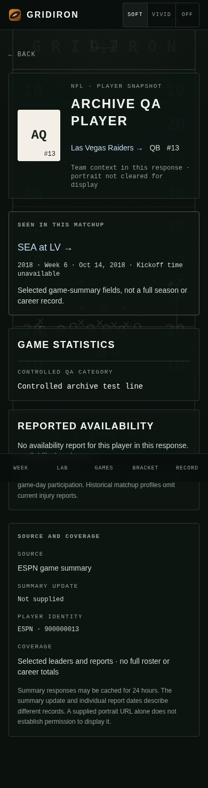
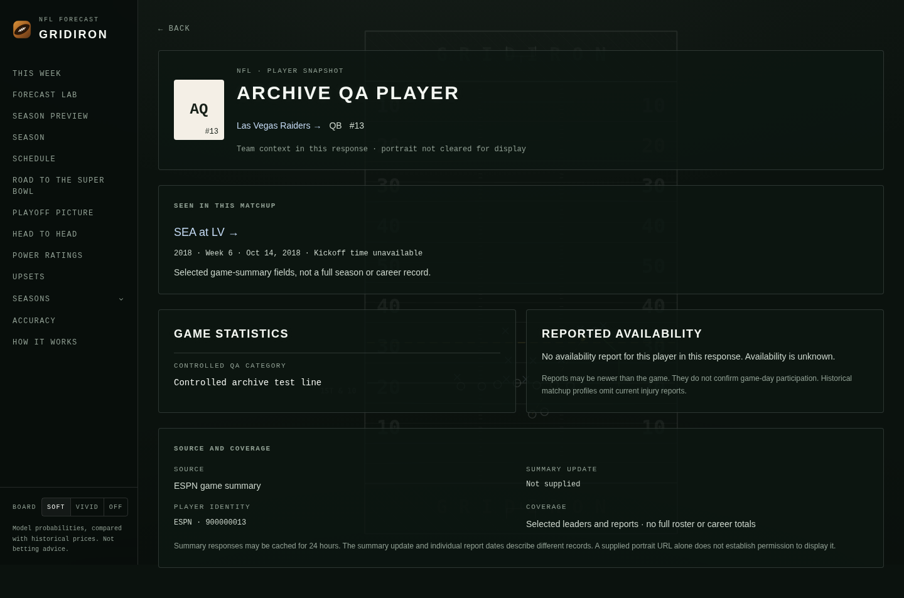
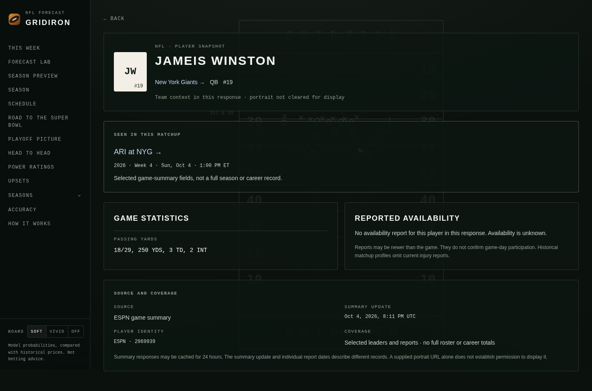
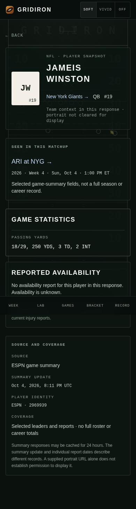
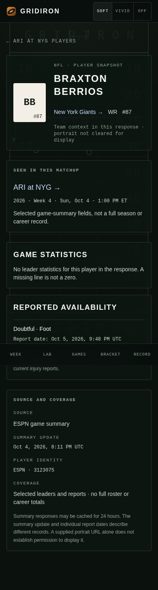
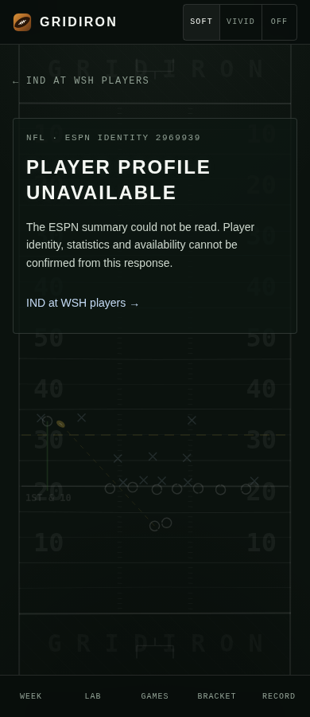

# Match-scoped player exploration — 2026-10-06

Started separately from merged browsing release `f9bdfa7c5db4a3cb52f4e008ece806b89b699076`.
The bounded journey is filtered week → matchup → player, or team → published
matchup → player. A profile links back to its matchup and team; Back restores
the originating history, filters and fixture links. It retains Gridiron's
football board, readable neutral data surfaces, labelled controls and reduced
motion behavior.

The final full-suite audit also reproduced a shared Back-control timing race:
a fast game response could mount before AppShell recorded navigation, leaving
the control as a canonical link. Back now listens when the navigation flag is
recorded as well as reading it on mount. Fresh tabs retain their safe named
parent; in-app transitions restore actual history consistently.

## Identity and available data

The existing [ESPN game summary](https://site.web.api.espn.com/apis/site/v2/sports/football/nfl/summary?event=401872966)
returned HTTP 200 in a read-only inspection. Event `401872966`, home NYG and
away ARI matched the published fixture. Its existing leader/injury fields
contained athlete IDs, names, positions, shirt numbers, display statistics and
individual report dates. The fixture in `scripts/fixtures/espn-player-summary.json`
retains a subset of those fact fields for repeatable tests; it excludes articles,
video, full payloads and image bytes.

Previously, normalization dropped athlete IDs. Both leaders and injury reports
now preserve them. `/players/espn/[id]?game=[event]` uses the provider and numeric
athlete ID as identity, with the game query selecting the source context. Names
are never slugged or used to merge players. Missing IDs leave names visible
without fabricated links. Repeated IDs combine category lines; conflicting team
context is withheld. Event ID and home/away participants must match the published
fixture before its response is shown.
OAK can resolve to published LV only with ESPN franchise ID `13`; a wrong or
missing alias ID and an unrelated abbreviation are withheld. This rule applies
to participants, team statistics, period scores, leaders and injury blocks.
ESPN IDs are distinct from the warehouse's internal numeric team IDs. This
bounded mapping covers OAK/LV; other historical abbreviations still require an
exact match.

Profiles reuse the **existing game-summary endpoint** and day cache. No athlete,
roster or career endpoint was added. Only events already in published forecasts
or the existing meeting index can be queried. Historical matchup profiles use
leaders and omit current injury reports. The new team entry points read the
existing fixture list and make no extra provider requests themselves.

## Freshness and coverage

The inspected summary's `meta.lastUpdatedAt` was **2026-10-04T20:11:04Z**.
Individual injury reports were newer; for example, the retained Braxton Berrios
report was **2026-10-05T21:48Z**. The UI displays these separately and explains
that a report does not confirm game-day participation. No report means unknown
availability; no leader line means missing statistics, not zero statistics.

The published forecast remains **2026-10-04T15:43:00Z**, with results used through
**2026-10-02T00:15:00Z**. This work changes no model, probability, data artifact,
backend, workflow or dependency/security setting. The Daily Forecast retry is
still unapproved and was not dispatched. No accuracy gain is claimed.

Coverage is selected leaders and reported availability in a particular response.
It is **not a full roster, season record or career profile**. No-context links,
unknown players/events, source outages and mismatched responses render useful
unavailable states with a named parent. Unsupported providers and name-slug IDs
render the app's missing-page recovery. A fresh tab keeps the canonical matchup
parent; invalid/unavailable profiles carry noindex metadata.

A global populated profile without a game context would require a published
provider-ID athlete index with source/as-of metadata and observed statistics/team
associations. Full roster/career coverage requires those additional records.
Neither dataset exists in the current published artifacts, and neither was
collected or inferred here.

## Portrait permission

An `AthleteImage` contract records provider, provider-qualified subject,
supplied URL, local asset path, provenance, permission status/evidence and
verification status/time. A source-supplied headshot URL is retained as an
unverified reference, never generated from an ID and never rendered or requested.
Untrusted permission fields in a provider response do not promote it.

Rendering requires a previously permitted, verified **local** `/athletes/` asset,
permission evidence, provenance and an exact subject match. No such approved
assets were available or added. Profiles use visible names, clean initials and
the supplied shirt number; no athlete images were downloaded. A future portrait
requires a reviewable permission/provenance record and verified local asset,
not merely an official or reachable URL.

## Verification

Local checks: nine profile/identity/date/image-policy tests; existing forecast
and week regressions; lint with zero warnings/errors; TypeScript; 116 backend
tests; production build with 321 static routes plus the dynamic profile route.
Next 15.5.24 and sharp 0.35.4 remain installed from the security lockfile.

Production Chromium at 320/390/768/1440 px exercised keyboard filtered-slate
entry, game/player links, Back to the same week/team/following values and fixture
links, and the team → game → player → Back journey. Fresh tabs, unknown identity,
missing context/event, invalid provider/name slug, a source outage, injury-only
statistics absence and a delayed loading skeleton were checked. Detected axe
violations, horizontal overflow, framework overlays, page exceptions and athlete
portrait requests were zero. Representative screenshots were visually inspected.
An additional default-audit pass blocked new summary requests. The built
response remained available from the existing cache, and profile/team returns
still passed. This does not verify a fresh provider response. The explicit
source-outage state was checked on another published event with a controlled 503.
The existing week/detail and Lab audits also passed at all four widths, including
the browsing release's same-path reset regression.
The Lab audit now allows two animation frames after viewport resizing before
measuring layout; its overflow and accessibility assertions remain enforced.

The populated browser check deliberately used the captured-response subset for
one existing event and an explicitly synthetic archive response; other ESPN
server requests returned controlled 503. Existing
team-logo CDN requests were aborted in the browser. This is repeatable UI evidence,
not a claim of live provider availability or site-wide player coverage. Profile
and week checks used the current browser clock; Lab used its explicit publication
clock. Manual screen-reader operation, all archive seasons, public deployment QA
and unexpected-render error-boundary retry were not tested here.

Reproduce the controlled check without collecting external records:

```bash
NODE_OPTIONS='--require ./scripts/player_browser_fixture.cjs' npm run build
NODE_OPTIONS='--require ./scripts/player_browser_fixture.cjs' \
  PLAYER_AUDIT_SLOW_EVENT=401872965 npm start -- --port 3024
# In another terminal:
BASE_URL=http://127.0.0.1:3024 PLAYER_AUDIT_EXPECT_FIXTURE=1 \
  PLAYER_AUDIT_SLOW_EVENT=401872965 BROWSER_EXECUTABLE_PATH=/usr/bin/chromium \
  npm run test:player-browser
```

Omit the executable override when Playwright's Chromium is installed.
`npm run test:browser` includes the profile audit without fixture requirements:
it records actual populated/unavailable coverage rather than assuming it.
The preloader is opt-in test tooling; it is never loaded by the application,
CI workflow or production job. Raw logs are retained in
`/workspace/nfl-player-review-2026-10-06/`.

### Review follow-up: archive dates and delayed navigation

The reviewed `8d366db` build treated a date-only archive record as midnight UTC.
Production Chromium reproduced `2018-10-14` displaying as **Oct 13, 8:00 PM ET**.
The [before result](screenshots/player-profile-archive-before.json) records the
reviewed app head and the controlled response used to isolate the date defect.
Contexts now retain explicit day/instant precision. Archived profiles render
**Oct 14, 2018 · Kickoff time unavailable**; real forecast timestamps still render
their Eastern kickoff. Invalid calendar dates render unavailable. Unit tests
cover actual published date shapes in both Eastern daylight and standard time.

The OAK/LV hypothesis was reproduced with a **controlled representative response**
for the already-published 2018 event `401030706`, whose artifact uses LV/SEA.
`scripts/fixtures/espn-archived-summary.json` is explicitly synthetic: its player
name and statistic are labelled QA, it supplies no summary update or portrait,
and it is only served by the opt-in test preloader. It is not a recorded ESPN
response or historical player evidence. No new provider records were collected
and no data artifact was refreshed. The real historical response and other
relocation aliases remain unverified.

Production Chromium passed archive checks at **390/1440 px**: calendar date,
unavailable kickoff, canonical LV team link, omitted current injury reports,
missing source update and Back to the archive matchup. A second regression held
the older Jameis Winston RSC response, navigated through Games to Braxton Berrios,
then released the older response. The newer URL, athlete identity and report
stayed in place. No application navigation change was needed for that case.
These checks supplement the four-width profile, week and Lab suites. The final
profile audit passed at **2026-10-06T16:01:22Z**, with zero detected axe violations,
overflow, overlays, page exceptions or portrait requests. Archive and delayed
response checks run in explicit controlled mode; CI's default profile audit
continues to report actual conditional coverage. Unit date/alias regressions
run in ordinary `npm test`.

[Follow-up browser results](screenshots/player-profile-archive-checks.json)





Machine-readable [profile results](screenshots/player-profile-checks.json) retain
source mode, dates, viewports, history assertions and portrait request count.





