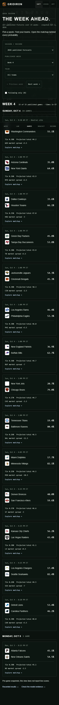
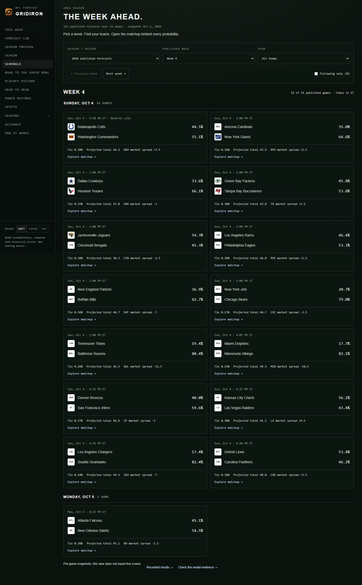
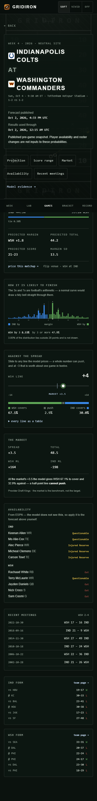
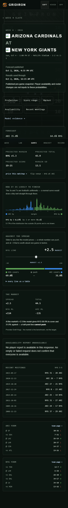
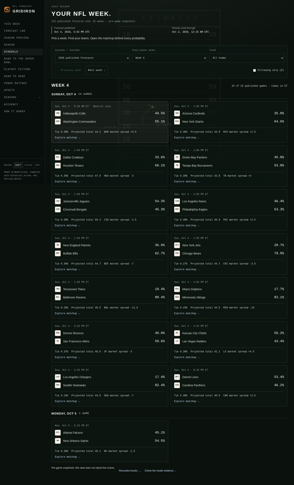
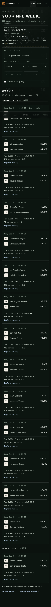
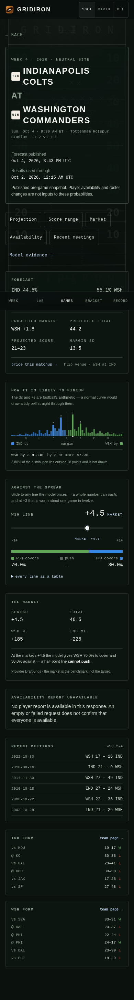
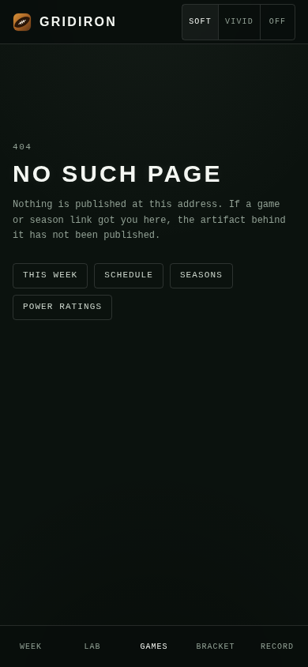
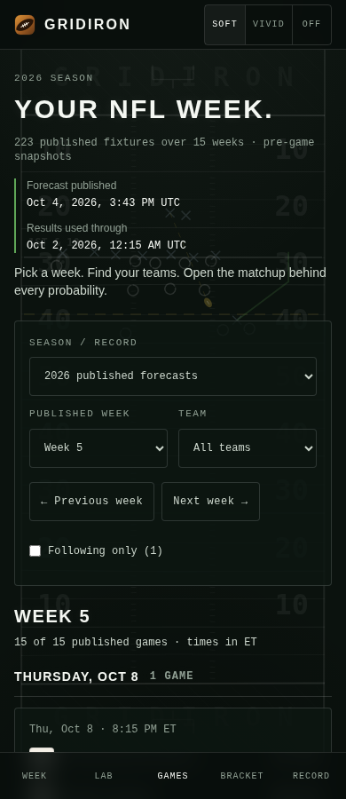
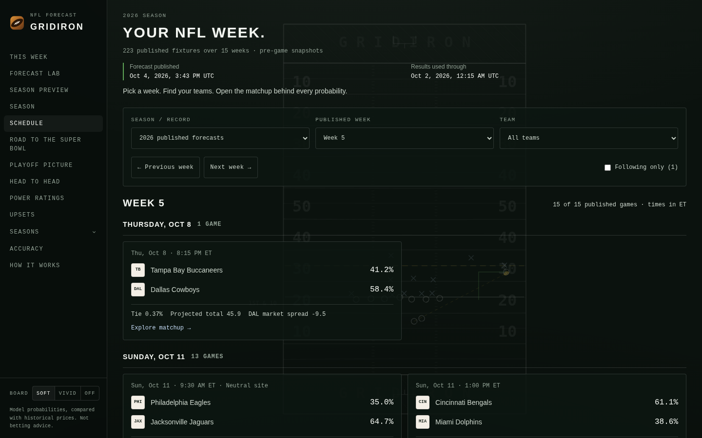

# Week and game browsing — October 2026

The original October 3 review below used the October 2 artifact and Edge.
The independently implemented cloud continuation and its current evidence are
recorded separately at the end of this document.

`/games` now opens a single published NFL week. Readers can choose an available
week, team or their existing local watchlist; the season selector distinguishes
published forecasts from recorded-results archives. Day groups and kickoff
times use Eastern time. `?week=4&team=IND&following=1` restores filters, including
browser Back. Empty filters offer a keyboard-accessible reset.

Game cards show full team names, win/tie probabilities, expected total and the
published market line, preserving the neutral-site flag. Remote marks fall back
to abbreviations while loading or after failure. Game detail adds the full
matchup, forecast publication time, results cutoff and section navigation. Its
existing margin lattice, spread slider, market, availability and recent meetings
remain connected to their original data. Section navigation moves focus without
adding a separate Back step. A missing injury response explicitly stays unknown.

The green field, typography, shared navigation and existing forecast calculations
remain the product's identity. The week hierarchy takes its reference from the
[official NFL schedule](https://www.nfl.com/schedules/).

## Verification

- Existing forecast-lab regression checks and new week/date assertions passed.
  The latter cover invalid week parameters, Eastern day boundaries, daylight
  saving time, ordering, empty data and input preservation.
- Repository lint and TypeScript passed. The production build completed all 321
  routes locally with two build workers and ESPN requests deliberately blocked.
- Headless Edge exercised the **production server** at 390, 768 and 1440 px:
  team/week URL changes, keyboard game links, section focus, the real spread
  slider, Back restoration, watchlist-empty recovery and no horizontal overflow.
  The season selector rendered the 2025 recorded-results page at 390 px.
- A separate production-browser check blocked ESPN/CDN requests and verified
  both the unavailable-availability panel and team abbreviation fallback.
  All audited flows had zero uncaught browser exceptions.
- Full-page slate and game screenshots were visually inspected at all three
  widths. Representative captures are below.

The published artifact inspected here was generated **2026-10-02T16:33:42Z**:
223 remaining fixtures across weeks 4–18. Week 4 contained 15 games. No fixtures
or probabilities were regenerated. The normal development-server check displayed
a successful ESPN injury response for Indianapolis–Washington; the production
outage check intentionally verifies the missing-response branch. Active-game
polling, every archived season and mobile screen-reader operation were not
tested. Local backend tests were not repeated for this frontend change; CI is
the broader gate. This work does not establish a model-quality improvement or
verify historical market timestamps as closes.






## Cloud continuation — 2026-10-06

Continued existing draft PR #2 from `47c1dc2af0b1e2acbf6ef6f5b5221b2bdde5014a`.
Merged security main `903353b21212eea8517a52581486132014820637` without conflicts
in merge commit `8dd2bcbc60ac638930e099f521ea7218e9bc6540`. The unpublished
laptop-only header-logo fallback was not available or recovered. The shared
`TeamLogo` fallback here is a **new cloud implementation**, independently checked
against failed, pending, successful and reloaded image responses. Week cards use
the same primitive. Its plates use cream/off-white instead of pure white.

The bounded polish adds exact publication and results-cutoff times to the slate,
keeps the green football identity and makes the mobile week/team controls share
a row. Team option abbreviations keep the selected club identifiable when a
native control truncates a long name. Existing full matchup names, labelled
controls, 44px targets, section focus and probability surfaces remain available.

### Data freshness

- Forecast publication: **2026-10-04T15:43:00Z**.
- Results used through: **2026-10-02T00:15:00Z**.
- 223 fixtures across published weeks 4–18; 15 already had earlier kickoff
  timestamps when checked on October 6. This is a set of pre-game snapshots,
  not a freshly fetched live slate.
- The stored live log was generated October 4; the offline evidence report
  still verifies 49 settled rows, Brier .23629 and accuracy 63.265%. This pass
  did not independently fetch outcomes, regenerate artifacts or train a model.
- The latest inspected [Daily Forecast run](https://github.com/roni-altshuler/nfl_predictor/actions/runs/37363962386)
  failed. Rerun approval remains pending; no rerun or production job was
  dispatched here. No model accuracy gain is claimed.

### Cloud verification

Node 24.19.0, npm 11.9.0, Python 3.12.14 and system Chromium 151.0.7922.173.
Required local checks passed: 116 backend tests; forecast contract and week/date
regressions; lint with zero warnings/errors; TypeScript; the 321-route production
build with the security versions installed from the lockfile (Next 15.5.24 and
sharp 0.35.4). Forecast artifacts, workflow definitions and deployment settings
match current main.

`npm run test:browser` now runs the existing Lab audit and the committed
`scripts/week_browser_audit.mjs`. Both ran against the production server.
The week/detail audit verified week bounds, Back/Forward, team URL restoration,
keyboard matchup entry, return to the filtered slate after section navigation,
keyboard spread selection, empty-watchlist reset, invalid query recovery,
the 2025 archive on mobile, missing-game recovery and a fresh-tab parent link.
It ran without overriding the browser clock. The Lab audit used its explicit
`AUDIT_USE_PUBLICATION_TIME=1` option to keep scenario inputs coherent with the
stored snapshot; that does not verify today's live schedule.

Week, detail and Lab checks at 320/390/768/1440 px found zero detected axe
violations, horizontal overflow, framework overlays or uncaught page exceptions.
Agent-browser also exercised the production week selector and team filter.
Representative full-page and viewport screenshots were inspected visually.

For the outage check, a temporary local fetch preloader returned 503 for ESPN
during build/server execution; browser requests to the ESPN logo CDN were
aborted. It does not change committed application fetch behavior. Availability
remained explicitly unknown. Pending marks retained their letters; successful
decode/reload checks used a controlled bundled favicon PNG **only as an image
response fixture**, not as an NFL mark. Cloud Chromium's natural ESPN CDN
requests also failed, so successful real CDN delivery was not verified.

The missing-game route rendered its recovery UI and `noindex` metadata with HTTP
**200** after streaming began, consistent with [Next 15's documented behavior](https://nextjs.org/docs/15/app/api-reference/file-conventions/not-found).
Without JavaScript, the static slate retains abbreviation marks; a separate
manual check found streamed matchup detail stays on its loading shell.
Active-game polling, every archive season and manual screen-reader operation
were not tested. These are remaining coverage limits, not completed checks.

Reproduce against an existing production build/server (the executable override
is optional when Playwright's bundled Chromium is installed):

```bash
BASE_URL=http://127.0.0.1:3018 \
AUDIT_USE_PUBLICATION_TIME=1 \
BROWSER_EXECUTABLE_PATH=/usr/bin/chromium \
npm run test:browser
```

The optional `WEEK_AUDIT_EXPECT_UNAVAILABLE=1` asserts the controlled
missing-report branch when the server/build is deliberately offline.
Machine-readable [week/detail results](screenshots/week-cloud-checks.json)
and [Lab results](screenshots/lab-cloud-checks.json) retain clocks and scope.
Raw logs and all widths are saved in
`/workspace/nfl-week-review-2026-10-06/` in the selected cloud environment.






### Independent-review follow-up — same-path navigation

Production Chromium reproduced a missed case on head `261286e3ab3b9b731959682fca8c9234ab4aedf3`
at both 390 and 1440 px. Starting at `/games`, selecting Week 18, IND and
Following produced `/games?week=18&team=IND&following=1` with one fixture.
Clicking the mobile **Games** or desktop **Schedule** app link changed the URL
to `/games`, but retained the selected filters and fixture. Back restored the
filtered URL; Forward reset the controls. Directly loading the filtered URL
before clicking the app link already reset correctly. The original audit
missed the filter-control arrival path.

The narrow fix subscribes to Next's query changes in addition to the existing
mount/history restoration. Only that subscription sits inside Suspense, keeping
the static slate available without JavaScript. No layout, source, forecast,
workflow or dependency changes were needed for this fix.

The added browser regression failed against the old production build with URL
`/games` and stale Week 18/IND/Following controls. It then passed against the
revised production build for **both entry paths at 390 and 1440 px**, comparing
the URL, all three filter values and every visible fixture link after app
navigation, Back and Forward. On October 6, the clean URL restored Week 5,
all teams, Following off and 15 fixtures; Back restored Week 18/IND/Following
and its one fixture; Forward restored the clean slate. Agent-browser independently
exercised the same mobile control/navigation/history sequence.

Required checks passed again: 116 backend tests, frontend regressions, lint,
TypeScript and all 321 production routes. The full week/detail and Lab audits
passed again at 320/390/768/1440 px with zero detected axe violations, overflow,
overlays or uncaught page exceptions; the no-JavaScript slate check also passed.
The controlled ESPN outage and clock scope remain as documented above, and
the October 4 forecast / October 2 results cutoff is unchanged.

The [updated machine results](screenshots/week-navigation-checks.json) include
all four navigation sequences and fixture URLs. Old-build failure details and
raw before/after logs are retained in
`/workspace/nfl-week-review-2026-10-06/same-path/`.



